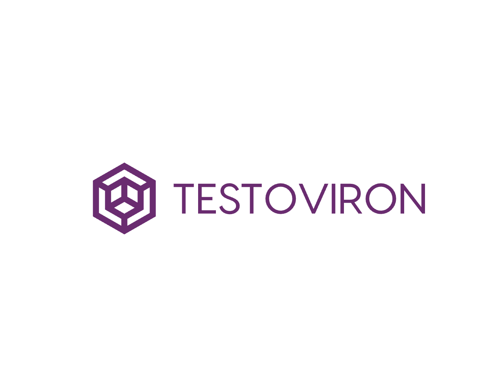

<p align="center">
  
</p>
<h3 align="center"> Testoviron - repository of practice testing examples with popular libraries. </h3>

## Repository overview 🎨

<strong>Testoviron</strong> - repository contains practice testing examples. <br>
Created with many popular libraries and ❤️❤️

<strong>Topics tested:</strong> <br>
- [x] - JSX + basic example
- [x] - Advanced JSX
- [x] - Props + State
- [x] - Custom Hooks
- [x] - Fetching data
- [x] - MSW
- [x] - Context API
- [x] - Zustand
- [x] - Supabase
- [x] - React Hook Form + Zod
- [x] - General Forms
- [x] - Asynchronous 

For more information or if you need some examples, please contact with us!

## Tech/framework used 🧰

| Tech                                                                                                                                              | Description |
| ------------------------------------------------------------------------------------------------------------------------------------------------- | ----------- |
|                           | Framework       |
|                           | Logic       |
|                         | Bundler       |
|  | IDE         |
|  | Package Manager         |

## Librares 🧰

| Tech                                                                                                                                              | Description |
| ------------------------------------------------------------------------------------------------------------------------------------------------- | ----------- |
|                          | State management       |
|                          | Styling       |
|                          | Supabase       |
|                          | UI Docs       |
|                          | Testing       |
|                       | Testing       |


## How to install 🎨

```npm
  1. npm install (Install all packages.)
  2. npm run test
```
